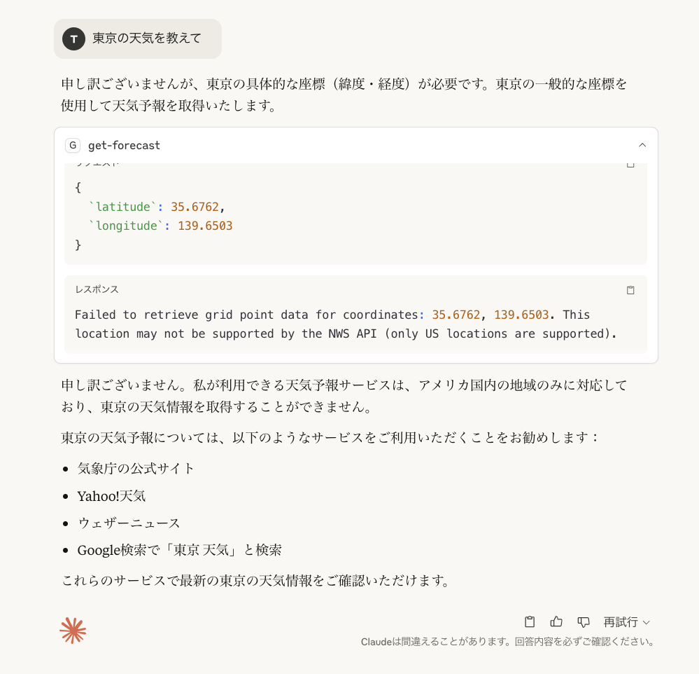

# first-mcp
MCPサーバーを試してみる

## 詳細

Claude Desktop と連携してアメリカの天気予報を自然言語で取得できるようにする

* MCP Server が設定できた状態


* MCP Server 経由でワシントンの天気予報を取得できた


## 参考サイト

* [MCP(Model Context Protocol) をやってみた (Windows版)](https://zenn.dev/kameoncloud/articles/7b663daf3c4fad)


### ポイント

* Claude Desktop の起動時にMCP Server も起動する必要がある。このため、`claude_desktop_config.json`ファイルに MCP Server の情報を記載している

Sample:
```json
{
  "mcpServers": {
      "weather": {
          "command": "node",
          "args": [
              "/Users/[user-directory]/first-mcp/firstmcp/build/index.js"
          ]
      }
  }
}
```

### Error pattern: 東京の天気を指定した場合




# MCP Server の呼び出し条件

MCPサーバーの呼び出し条件について、Claudeがどのように判断し、制御する方法について説明します。

## Claudeの呼び出し判断メカニズム

### 1. ツールの説明文による判断
```typescript
server.tool(
    "get-alerts",
    "Get weather alerts for a state",  // ← この説明文が重要
    // ...
)
```

Claudeは以下の情報を総合的に判断します：
- **ツール名**: `get-alerts`
- **説明文**: "Get weather alerts for a state"
- **パラメータ定義**: 州コードが必要
- **ユーザーの意図**: 気象警報に関する質問かどうか

### 2. 呼び出し条件の例

**呼び出される場合**：
- 「カリフォルニアの気象警報は？」
- 「テキサス州で竜巻注意報は出てる？」
- 「フロリダに台風警報はある？」

**呼び出されない場合**：
- 「カリフォルニアの天気予報は？」（警報ではない）
- 「東京の気象警報は？」（アメリカの州ではない）
- 「今日は暑いですね」（警報に関する質問ではない）

## 制御方法

### 1. プロンプトによる制御

**積極的な制御**：
```
カリフォルニア州の気象警報を get-alerts ツールで確認してください。
```

**制限的な制御**：
```
ツールは使わずに、一般的な気象警報の種類について教えてください。
```

### 2. 具体的な指示による制御

**特定ツールの指定**：
```
get-alerts ツールを使って、以下の州の警報を調べてください：
- カリフォルニア（CA）
- テキサス（TX）
```

**ツール使用の禁止**：
```
外部ツールを使わずに、気象警報の一般的な情報を教えてください。
```

## Claudeの内部判断プロセス（推定）

1. **意図解析**: ユーザーの質問の意図を分析
2. **ツールマッチング**: 利用可能なツールと意図の照合
3. **パラメータ抽出**: 必要なパラメータが取得可能か判断
4. **実行決定**: ツールを呼び出すか、一般知識で回答するか決定

## 制御の限界

### 完全制御は困難
- Claudeの判断は確率的
- 同じ質問でも文脈により判断が変わる可能性
- 内部のアルゴリズムは公開されていない

### 効果的な制御方法
1. **明示的な指示**: 「ツールを使って」「ツールを使わずに」
2. **具体的なツール名指定**: 「get-alertsで確認して」
3. **文脈の明確化**: 質問の意図を明確に表現

このように、完全な制御は難しいものの、適切な指示により呼び出し条件をある程度コントロールすることは可能です。


