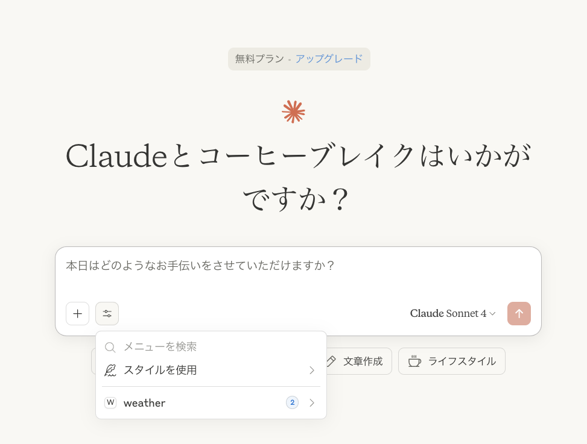
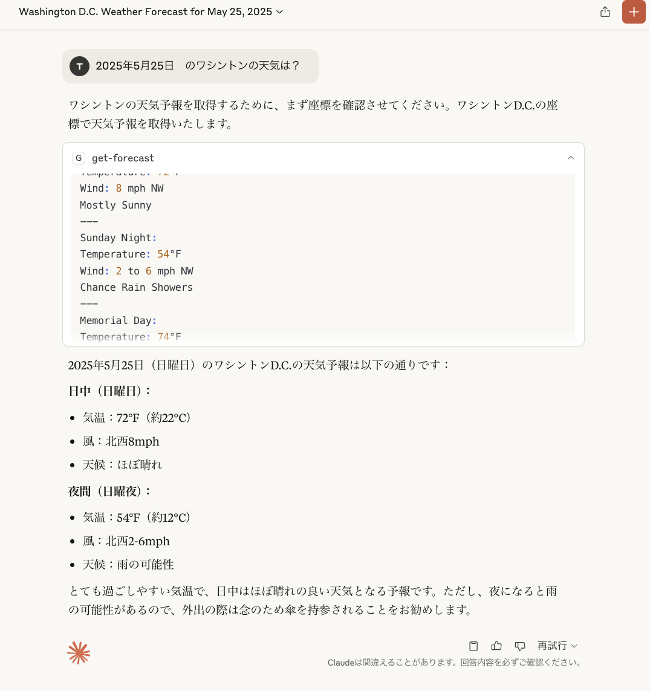

# first-mcp
MCPサーバーを試してみる

## 詳細

Claude Desktop と連携してアメリカの天気予報を自然言語で取得できるようにする

* MCP Server が設定できた状態


* MCP Server 経由でワシントンの天気予報を取得できた


## 参考サイト

* [MCP(Model Context Protocol) をやってみた (Windows版)](https://zenn.dev/kameoncloud/articles/7b663daf3c4fad)


### ポイント

* Claude Desktop の起動時にMCP Server も起動する必要がある。このため、`claude_desktop_config.json`ファイルに MCP Server の情報を記載している

Sample:
```json
{
  "mcpServers": {
      "weather": {
          "command": "node",
          "args": [
              "/Users/[user-directory]/first-mcp/firstmcp/build/index.js"
          ]
      }
  }
}
```
